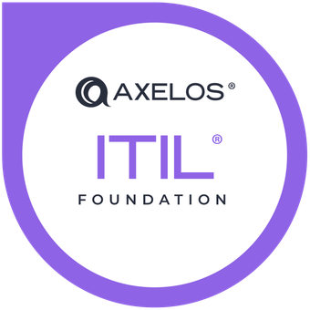

<h2 align="center">

</h2>

<h5 align="center">
    
I am a Systems Administrator with a passion for cybersecurity and a background in managing and securing IT environments. Here, you'll find my projects and contributions focused on 
enhancing security measures and protecting organizational assets. Feel free to explore and connect!.

</h5>

 

&nbsp;

<h4 align="center"> 【 Projects 】

</h4>

<table align="center">
    <thead align="center">
        <tr align="center">
            <th align="center">
                
            </th>
            <th align="center">
                
            </th>
        </tr>
        <tr align="center">
            <th align="center">
                
            </th>
            <th align="center">
                
            </th>
        </tr>
        <tr align="center">
            <th align="center">
                
            </th>
            <th align="center">
                
            </th>
        </tr>
    </thead>
</table>

<h4 align="center"> 
    
【 Certifications 】

    
    
    
    
    
    
    
    
    
</h4>

<h4 align="center"> 

 【 Tool Box 】

</h4>

    
    
    
    
    
    
    
    
    
    
    
    
    
    
    </a>

<h4 align="right"> 
    

</h4>
